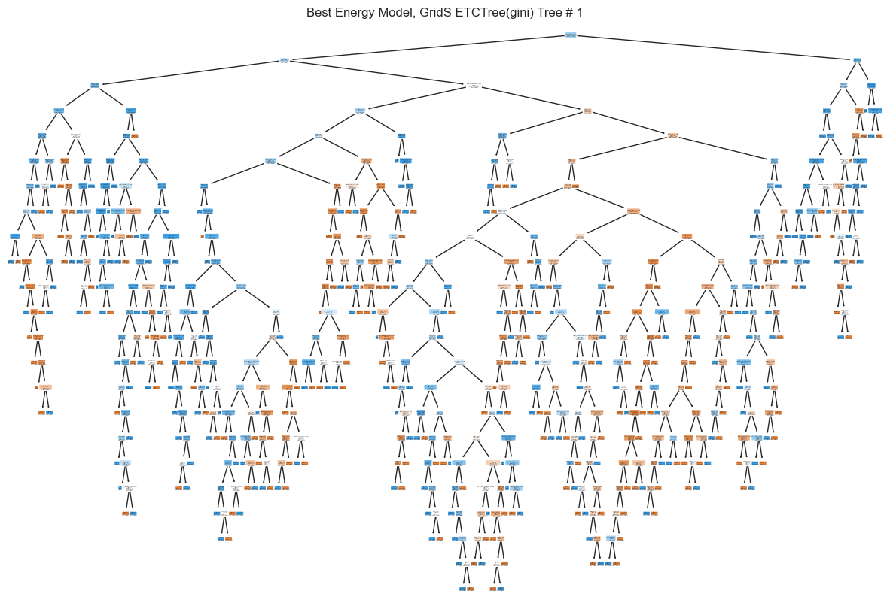

# Stock Market Analysis
##### Analyzing the Stock Market with Time Series Models and Classification Models

By: David Hartsman
Disclaimer: This notebook should not be considered any kind of financial advice. It exists only for the purposes of practicing modeling and making predictions

### Overview
In this project, I took a multi-pronged approach to predicting performance of the stock market. I analyzed price movement at the index level and sector level. I first developed predictive models using a qualitative target: whether or not an asset appreciated over a one, three, six, or twelve month period. My second approach to predicting the stock market utilized time series modeling on the index level. 

### Data Understanding
For all of the project avenues, a similar process was used to [gather and prepare](https://github.com/dvdhartsman/Stock_Market_Analysis/blob/main/Data_Prep/Data_Downloads_and_Processing.ipynb) the data. I downloaded data from yfinance, the Yahoo! Finance api. The data was initially fairly straightforward, containing features for the ticket, adjusted close, close, high, low, open, and volume. I supplemented that data by downloading data from Federal Reserve Economic Data by using pandas_datareader, adding historical data for interest rates and GDP. I also added several technical indicators to the data by using the pandas_ta library. That library is filled with functions that calculate many frequently used technical indicators such as ATR, MACD, RSI, etc. I then added to my data the 5 Fama-French indicators maintained and shared by Kenneth French from Dartmouth University, an accomplished and respected professor. The final component of data preparation involved me finding dates in the data that corresponded to the time horizons I previously described. I then created feature columns for each time horizon: one that was binary indicating whether the asset went up in value or not, and another set of features that displayed the percent change in the asset's value in the future. The latter features were created for inferential purposes. 

### Evaluation
The predictions of models created using binary targets were rather impressive. The best-performing models were consistently tree based models, and the ExtraTreesClassifier in particular frequently produced the most accurate test scores. Here you can see just one of the hundred estimators in one such model. Seeing this tree helps to understand how its many levels of depth can help make such accurate predictions. 

One of the most attractive features of the models I produced for different sectors was their ability to minimize downside risk. There are many box plots in the [SPDR evaluation notebook](https://github.com/dvdhartsman/Stock_Market_Analysis/blob/main/2b_SPDR_Eval.ipynb) that demonstrate how effective the models were at preventing negative outlier results specifically for their targeted timeframe. The one outlier present was a prediction made in March of 2019 for 12 months into the future; this prediction was 1 year before the onset of the pandemic.  

### Conclusion

