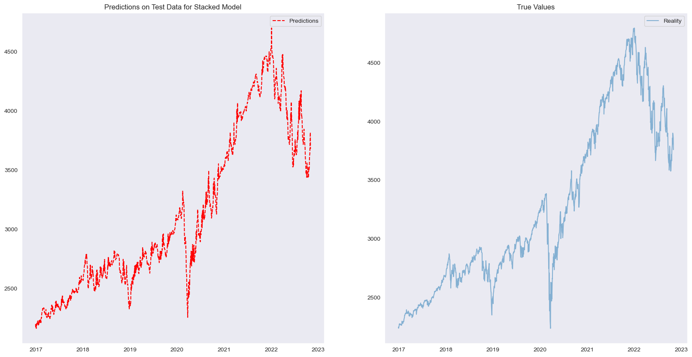
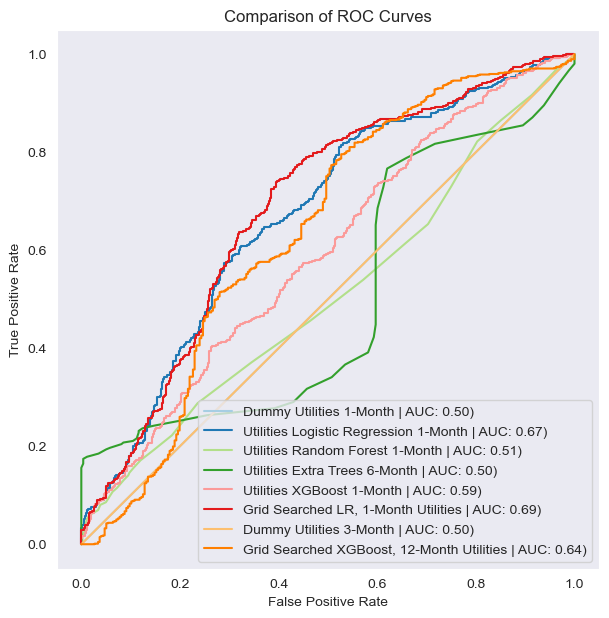

# Stock Market Analysis
#### Analyzing the Stock Market with Time Series Models and Classification Models

By: David Hartsman

#### Instructions for navigating the repo:

[Slide Deck](https://github.com/dvdhartsman/Stock_Market_Analysis/blob/main/Stock%20Market%20Presentation.pdf)

[Data_Downloads_and_Processing](https://github.com/dvdhartsman/Stock_Market_Analysis/blob/main/Data_Prep/Data_Downloads_and_Processing.ipynb)

[1_Index_Profitability_Classification](https://github.com/dvdhartsman/Stock_Market_Analysis/blob/main/1_Index_Profitability_Classification.ipynb) - Modeling and observations for the Dow Jones, S&P 500, Nasdaq, and Russell 2000

[2a_SPDR_ETF_modeling](https://github.com/dvdhartsman/Stock_Market_Analysis/blob/main/2a_SPDR_ETF_modeling.ipynb) - Overview of sector SPDRs and is primarily for model iterations

[2b_SPDR_Eval](https://github.com/dvdhartsman/Stock_Market_Analysis/blob/main/2b_SPDR_Eval.ipynb) - Evaluation and summary of the SPDR modeling

[3_S&P_Time_Series](https://github.com/dvdhartsman/Stock_Market_Analysis/blob/main/3_S%26P_Time_Series.ipynb) - ARIMA modeling

[4_LSTM_Neural_Networks](https://github.com/dvdhartsman/Stock_Market_Analysis/blob/main/4_LSTM_Neural_Networks.ipynb) - LSTM neural network

##### Disclaimer: This notebook should not be considered any kind of financial advice. It exists only for the purposes of practicing modeling and making predictions

### Overview
In this project, I took a multi-pronged approach to predicting performance of the stock market. I analyzed price movement at the index level and sector level. I first developed predictive models using a qualitative target: whether or not an asset appreciated over a one, three, six, or twelve month period. My second approach to predicting the stock market utilized time series modeling on the index level. 

### Data Understanding
For all of the project avenues, a similar process was used to [gather and prepare](https://github.com/dvdhartsman/Stock_Market_Analysis/blob/main/Data_Prep/Data_Downloads_and_Processing.ipynb) the data. I downloaded data from yfinance, the Yahoo! Finance api. The data was initially fairly straightforward, containing features for the ticket, adjusted close, close, high, low, open, and volume. I supplemented that data by downloading data from Federal Reserve Economic Data by using pandas_datareader, adding historical data for interest rates and GDP. I also added several technical indicators to the data by using the pandas_ta library. That library is filled with functions that calculate many frequently used technical indicators such as ATR, MACD, RSI, etc. Then I added the [5 Fama-French factors](https://mba.tuck.dartmouth.edu/pages/faculty/ken.french/Data_Library/f-f_factors.html) maintained and shared by Kenneth French at Dartmouth University, an accomplished and respected professor and financial mind. I then created feature columns for each time horizon. One column was composed of binary values indicating whether the index/ETF went up in price or not, and another set of features that displayed the percent change in the asset's value at target dates in the future. The percent change features were only created for inferential purposes. 

### Evaluation
I modeled [major index](https://github.com/dvdhartsman/Stock_Market_Analysis/blob/main/1_Index_Profitability_Classification.ipynb) returns, as well as returns for [SPDR ETFs](https://github.com/dvdhartsman/Stock_Market_Analysis/blob/main/2a_SPDR_ETF_modeling.ipynb) that represent the 11 sectors of the stock market. As I said, the targets of the models were binary, describing whether the price went up or down over different target periods of time. The predictions of models created using binary targets were extremely varied. Precision was the target metric, as the practical application of these models would be to make correct "buy" recommendations, and not to have false positives. The best-performing models were consistently boosted tree based models. Here you can see just one of the hundred estimators in one such model.  

One of the noteable characteristics of the models I produced was their ability to minimize downside risk, particularly over longer time horizons. Downside risk was more difficult to manage for one and three month targets. There are many box plots in the [SPDR evaluation notebook](https://github.com/dvdhartsman/Stock_Market_Analysis/blob/main/2b_SPDR_Eval.ipynb) that demonstrate the models' ability to contain losses. 

I also utilized two different methods of Uni-Variate Time Series Modeling. I first attempted to create ARIMA models using only the past closing prices of the S&P 500. ARIMA stands for "auto-regressive integrated moving average". The work with ARIMA is found in [this notebook](https://github.com/dvdhartsman/Stock_Market_Analysis/blob/main/3_S%26P_Time_Series.ipynb).

The final approach to modeling that I took was using a Long Short-Term Memory neural network to predict stock prices. This is another form of uni-variate modeling. The only features I provided to the neural network were the past 15 days' closing prices. This model is particularly adept at storing memories from previous data and determining how much relevance that data has to the future predictions of the model.  

### Conclusion

The binary target models produced very unique modeling results. For example, when modeling 12-month Tech, I had two different models get 0% precision scores on unseen test data! That was one of two occasions that I failed to improve on the dummy model's precision score, the other being 3-month Communication Services, where the data were extremely sparse and imbalanced.

Many of the models' ROC curves and AUC scores were very different from other modeling projects I have done in the past. This seems to indicate how intrinsically difficult it is to predict the vicissitudes of the stock market. 

 

As I said earlier, tree based models were the most frequent representatives for each subset of the market that I modeled, though Logistic Regression models were occassionally the best candidates depending on use case. Generally speaking, the longer the time horizon, the more reliably the models could minimize risk. That does not mean that they produced the most gains, however.

With precision as my target metric, the positive-prediction rate of many of these models was very low. In order to focus on "useful" models, I had to inspect the positive-prediction rates along with the precision scores. Also, my efforts to tune models to precision often times had very surprising outcomes, causing these models to behave strangely. Suffice it to say, that the models did not always provide signals worth acting upon. Still, the mean performance when they did predict "buys" was generally quite strong, and improved upon dummy mean performance.

In regards to Uni-Variate Time Series Modeling, the ARIMA model was the least impressive or instructive part of this project. The model did not seem well suited to predicting stock prices. The LSTM neural network, on the other hand, managed remarkably accurate predictions. There did tend to be a slight lag and under-representation of the full measure of volatile moves, however the contours of the chart were well captured over a surprisingly long period of time. 

These models as a whole, can provide a supplemental, complimentary source of information, but none of them should be relied upon to outperform on their own. The stock market is extremely difficult to predict, and will move irrationally. Please be judicious in your decision making, and enjoy looking through the results of my research. Thank you very much!

[Gmail](dvdhartsman@gmail.com)

[LinkedIn](https://www.linkedin.com/in/david-hartsman-data/)

[GitHub](https://github.com/dvdhartsman)
